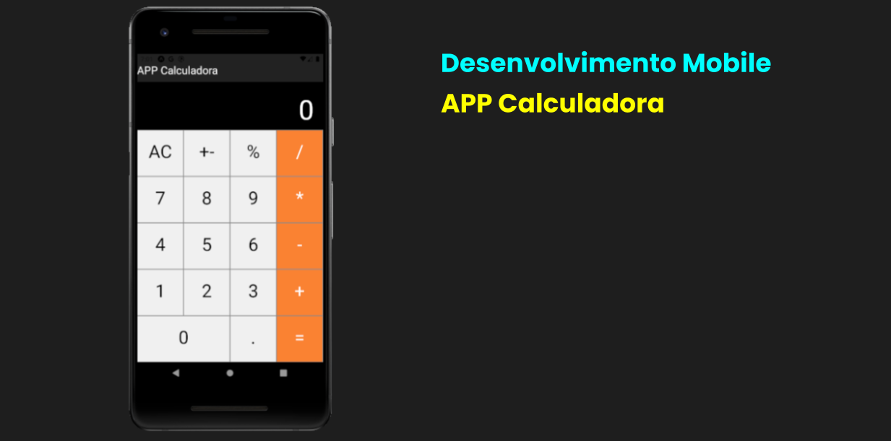

# App IMC
Projeto com exemplo básico de criação de componentes funcionais com React-Native.
Projeto criado no contexto da disciplina de desenvolvimento mobile.

## Assuntos abordados

- React Native
- Expo
- UseState
- Components